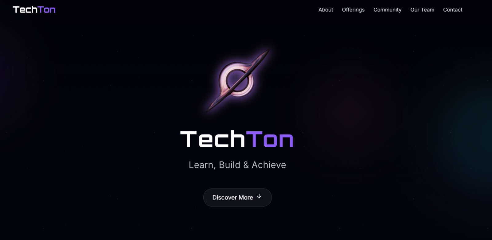
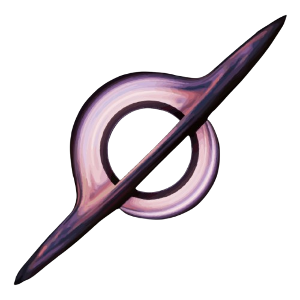

# 🌌 TechTon – Learn, Build & Achieve

Welcome to **TechTon**, a futuristic, dark-themed single-page website designed for our tech organization dedicated to **spreading awareness, mentoring peers, and sharing opportunities** in the world of tech.  
Built using **React**, **Vite**, **TypeScript**, and **TailwindCSS** — the site is sleek, fast, and fully responsive.

## 🚀 Live Demo

🔗 [Visit the site](https://techton.vercel.app/)

---

## 📌 Sections Overview

### 1. 🪐 Hero Section
- Animated central glowing logo (black hole inspired)
- Tagline: _“Learn, Build & Achieve”_
- Particle background for a galactic vibe
- Scroll-down indicator

### 2. 🌟 About TechTon
- Who we are and what we do
- Clean layout with galaxy-themed section dividers

### 3. 💡 What We Offer
- Grid of 4 animated cards:
  - Hackathons & Competitions
  - Good Info (Tech Updates)
  - Jobs & Internships
  - Coding Support (LeetCode, etc.)

### 4. 👨‍💻 Admin Profile
- Haris Mughal's contact card with:
  - LinkedIn
  - GitHub
  - Portfolio

### 5. ✉️ Join Us / Contact
- Fully working **contact form** with Formspree integration
- CTA: _“Become a TechTonian”_
- Link to our official [LinkedIn Page](https://www.linkedin.com/company/techton-618)

---

## 🛠️ Tech Stack

- **Framework**: React
- **Build Tool**: Vite
- **Language**: TypeScript
- **Styling**: TailwindCSS + HTML + CSS
- **Animations**: Tailwind Transitions, Framer Motion
- **Form Backend**: Formspree

---

## 🖼️ Design Philosophy

- Dark mode-first design with starfield/nebula vibes  
- Clean, modern typography (Inter / Orbitron)  
- Minimalist layout with smooth section transitions  
- Mobile-first responsiveness  

---

## 📄 License

This project is open-source and free to use under the [MIT License](LICENSE).

---

## 💫 Made with love by  
**[Haris Mughal](https://www.linkedin.com/in/iamharisahsan/)** – Founder of TechTon  
MIT² Global Finalist · Harvard Puzzles Winner · Stanford Section Leader

